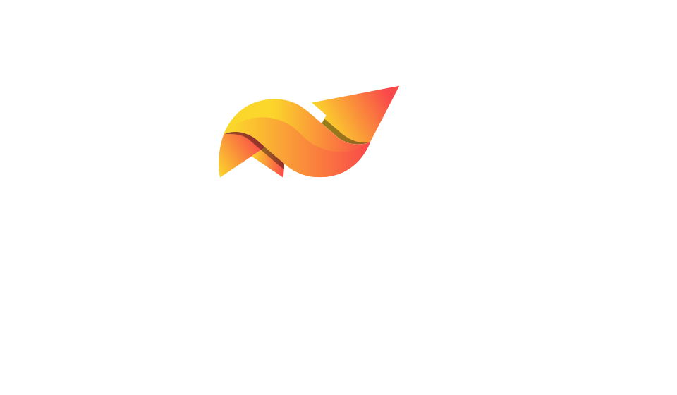

class: middle, slide-front-page

# warsawjs-online-support-slides

## Subtitle



---

class: middle, slide-front-page, no-display-my-logo

<div class="talk-card">
  
  <div class="details">
    
    <h2 class="speaker-name">Piotr Kowalski</h2>
    <h1 class="talk-title">INSERT_TITLE</h1>
    <p class="talk-perform">2020-??-??</p>
    <p class="speaker-contact">
      <a href="https://www.linkedin.com/in/piecioshka">linkedin.com/in/piecioshka</a>
    </p>
  </div>
</div>

---

### Code Snippet

```js
const `foo` = 2;

const go = async (client) => {
     await client.url('http://example.org');
     await client.assert.count('p', 2);
 }
```

```json
module.exports = {
  "extends": [
    "tslint:recommended"
  ]
};
```

---

class: center, middle

# HEADER lvl 1 <span class="slim">slim</span>

## HEADER lvl 2 <span class="slim">slim</span>

### HEADER lvl 3 <span class="slim">slim</span>

#### HEADER lvl 4 <span class="slim">slim</span>

##### HEADER lvl 5 <span class="slim">slim</span>

###### HEADER lvl 6 <span class="slim">slim</span>

---

.size10[Text 1]
.size20[Text 2]
.size30[Text 3]
.size40[Text 4]
.size50[Text 5]
.size60[Text 6]
.size70[Text 7]
.size80[Text 8]

.size90[Text 9]
.size100[Text 10]
.size110[Text 11]

.size120[Text 12]
.size130[Text 13]

---

### Colors

* <ins>gray text</ins>
* `gray`
* _blue_
* <mark>yellow</mark>
* <del>red</del>
* <samp>cyanosed (siny)</samp>
* <var>green</var>

---

class: slide-background-brown

### Typography

* **Bold**
* Regular
* <span class="slim">Slim</span>

---

class: middle, slide-invert-colors

## [Ćwiczenie] pt. _NAZWA_

* Podpunkt 1
* Podpunkt 2
* Skrót <kbd>Ctrl + r</kbd>

---

class: slide-background-blue

### Lists

.left.p-5[

List unordered

* foo
    - bar

List ordered

1. foo
2. bar

]

.left.p-5[

List circled

.list-circled[

* foo
* bar

]

List squared

.list-squared[

* foo
* bar

]

]

.left.p-5[

List unstyled

.list-unstyled[

* foo
* bar

]

]

---

class: slide-invert-colors

### White on black

---

### Table

H1 | H2 | H3
:--- | :---: | ---:
1 | 2 | 3
4 | 5 | 6

-

.table-borderless.table-striped.table-hover.table-small[

H1 | H2 | H3
:--- | :---: | ---:
1 | 2 | 3
4 | 5 | 6
7 | 8 | 9

]

---

class: middle, slide-fullscreen-blockquote

> Pierwszy krok rzadko bywa do tyłu
> <small>Loesje</small>

---

.tag-cloud.change-color[

* color 1
* color 2
* color 3
* color 4
* color 5

]

.tag-cloud.change-color.list-inline[

* color 1
* color 2
* color 3
* color 4
* color 5

]

.tag-cloud.change-size.list-inline[

* color 1
* color 2
* color 3
* color 4
* color 5

]

---

test (regular)

.mirror-horizontal[
    text (mirror horizontal)
]

.mirror-vertical[
    text (mirror vertical)
]

---

class: slide-columns-3

## Columns

.size30[

* item 1
* item 2
* item 3
* item 4
* item 5
* item 6
* item 7
* item 8
* item 9
* item 10
* item 11
* item 12
* item 13
* item 14
* item 15
* item 16

]

---

class: slide-grid, slide-grid-2-columns, slide-grid-with-apla

### Siatka

.grid-board[

1) Item nr 1 — Nisi non culpa cupidatat nulla cupidatat aliquip anim.

2) Item nr 2 — Irure dolore aute laborum non qui nostrud tempor officia quis commodo.

3) Item nr 3 — Tempor consequat quis reprehenderit

4) Item nr 4 — Est enim laborum est Lorem reprehenderit laborum voluptate do labore.

]

---

class: middle, center, slide-card-list, slide-card-list-rounded

.card[]
.card[]
.card[]

---

class: middle, center, slide-invert-colors, no-display-my-logo, no-display-twitter-handle

# <del>Dziękuję!</del>


.size30[
Proszę o rekomendację:
[fb.com/piecioshka.trener](https://fb.com/piecioshka.trener)
]
